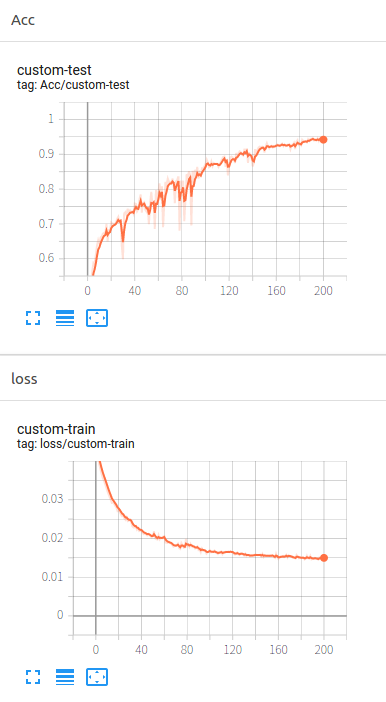

## Environment

```python
pytorch >= 1.4
python 3.7
tensorborad > 2.0
```

## Dataset

You can organize dataset like this:

```
---data
	+---cats
	|       cat.1.jpg
	|       cat.3.jpg
	|       cat.3.jpg
	        ......
	+---dogs
	|       dog.1.jpg
	|       dog.2.jpg
	|       dog.3.jpg
	        ......
	+---horses
	|       horse-1.jpg
	|       horse-2.jpg
	|       horse-3.jpg
	        ......
	---humans
	|    	rider-1.jpg
	|    	rider-3.jpg
	|   	rider-3.jpg
                ......
```

You can download data from BaiduPan to train this network. 提取码:ypvq

https://pan.baidu.com/s/1GCrAilyBoShfzrONQdlXBQ

 

**Custom Dataset**

Remeber to change 'labels'  to your class name at *dataset.py* line 13.


## Tarin

Set the options you want to adjust for better results at *train.py* line 16-28.



## Predict

Set the options you want to adjust for testing result you train at *detect.py* line 16-23.